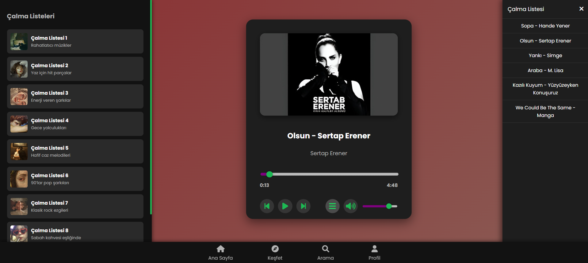

Galadriel - Music App
Galadriel, JavaScript, HTML ve CSS kullanılarak geliştirilmiş modern ve kullanıcı dostu bir müzik çalma uygulamasıdır. Bu uygulama, kullanıcıların müzik dosyalarını oynatmasına, çalma listeleri oluşturmasına ve müzik dinleme deneyimini kişiselleştirmesine olanak tanır. Not: Projenin backend kısmı henüz geliştirilme aşamasındadır ve şu anda yalnızca frontend özellikleri kullanılabilir.
Özellikler

Müzik Oynatma: MP3 ve diğer yaygın ses formatlarını destekler.
Çalma Listesi Yönetimi: Kullanıcılar çalma listeleri oluşturabilir, düzenleyebilir ve silebilir.
Kullanıcı Dostu Arayüz: Minimalist ve modern bir tasarımla kolay kullanım.
Kişiselleştirme: Tema seçenekleri ve oynatma kontrolleri.
Responsive Tasarım: Masaüstü ve mobil cihazlarla uyumlu.

Kurulum
Gereksinimler

Modern bir web tarayıcısı (Chrome, Firefox, Safari vb.)
Yerel bir geliştirme ortamı (örneğin, VS Code veya herhangi bir metin editörü)
(Opsiyonel) Yerel bir sunucu (örneğin, Node.js ile http-server veya VS Code Live Server eklentisi)

Adımlar

Depoyu Klonlayın:git clone https://github.com/kullanici/galadriel.git

Proje Dizinine Gidin:cd galadriel

Dosyaları Açın:
Proje dosyalarını bir metin editöründe açın (örneğin, VS Code).
Yerel bir sunucu kullanarak uygulamayı başlatın. Örneğin:npx http-server

Alternatif olarak, index.html dosyasını doğrudan bir tarayıcıda açabilirsiniz (ancak bazı özellikler yerel sunucu olmadan çalışmayabilir).

Uygulamayı Tarayıcıda Görüntüleyin:
Tarayıcınızda http://localhost:8080 (veya kullanılan port) adresine gidin.

Kullanım

Müzik Yükleme: Uygulama arayüzünden yerel müzik dosyalarınızı yükleyin.
Çalma Listesi Oluşturma: "Çalma Listesi Ekle" butonunu kullanarak yeni bir çalma listesi oluşturun.
Müzik Çalma: Şarkıları seçin ve oynatma kontrollerini kullanarak oynatın, duraklatın veya geçin.
Temayı Değiştirme: Ayarlar menüsünden istediğiniz temayı seçin.

Not: Backend henüz hazır olmadığından, müzik dosyaları yalnızca yerel olarak yüklenebilir ve çalma listeleri tarayıcı belleğinde saklanır.
Proje Yapısı
galadriel/
├── css/
│ └── style.css # Uygulamanın stilleri
├── js/
│ └── app.js # Uygulamanın ana JavaScript dosyası
├── images/ # Görseller ve ekran görüntüleri
├── index.html # Uygulamanın ana HTML dosyası
└── README.md # Bu dosya

Ekran Görüntüleri

Katkıda Bulunma

Bu depoyu fork edin.
Yeni bir özellik dalı oluşturun (git checkout -b feature/yeni-ozellik).
Değişikliklerinizi yapın ve commit edin (git commit -m 'Yeni özellik eklendi').
Dalınızı push edin (git push origin feature/yeni-ozellik).
Bir Pull Request açın.

İletişim
Sorularınız veya önerileriniz için erayoktay02@gmail.com adresinden iletişime geçebilirsiniz.
